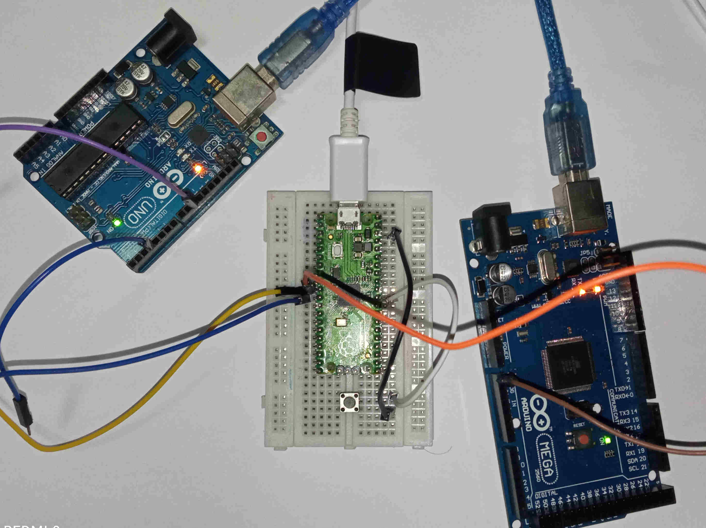

## Pin Capture Timer library for RP2040 using PIO

A library to capture signal edges on any pins of the RP2040 using PIO. It is compatible with the [SDK](https://raspberrypi.github.io/pico-sdk-doxygen/) and [Arduino](https://github.com/earlephilhower/arduino-pico).

How to use it:

- With SDK. Add *capture_edge.pio, capture_edge.h and capture_edge.c,* to your project. Modify CMakeLists.txt. Add *pico_generate_pio_header* and the required libraries (pico_stdlib, hardware_irq, hardware_pio, hardware_clocks). See [CMakeLists.txt](sdk/CMakeLists.txt)
- With Arduino. Add *capture_edge.pio.h, capture_edge.h and capture_edge.c* to your project
- Set the number of pins to capture with CAPTURE_EDGE_PIN_COUNT in *capture_edge.pio* or in *capture_edge.pio.h* if using Arduino. Capture pins starts at *pin_base*. All available pins can be captured.
- Define the capture handlers which receives the counter value and the edge type (fall or rise).
- Change CAPTURE_EDGE_IRQ_NUM if conflicts with other state machines irqs. Valid values 0 to 3.  

See [main.c](sdk/main.c) with code example to calculate *frecuency* and *duty*. Counter increments every 9 clock cycles. This value is defined in COUNTER_CYCLES. To obtain total clock divisor multiply:  COUNTER_CYCLES * *clk_div*.  
\
Functions:  
\
**uint capture_edge_init(PIO pio, uint pin_base, float clk_div, irq)**  

Parameters:  
&nbsp;&nbsp;**pio** - load the capture program at pio0 or pio1  
&nbsp;&nbsp;**pin_base** - set the first capture pin  
&nbsp;&nbsp;**clk_div** - set the clock divisor  
&nbsp;&nbsp;**irq** - select the pio irq. Valid values for pio0: PIO0_IRQ_0, PIO0_IRQ_1 and for pio1: PIO1_IRQ_0, PIO1_IRQ_1. Useful if other states machines are also using irqs.  

Returns:  
&nbsp;&nbsp;State machine used  
\
**void capture_edge_set_irq(uint pin, capture_handler_t handler)**  

Parameters:  
&nbsp;&nbsp;**pin** - pin to capture  
&nbsp;&nbsp;**handler** - function to handle the capture edge interrupt  
\
**void capture_edge_remove(void)**  

Reset handlers and removes pio program from memory.  
\
Handler functions:  
\
**void capture_handler(uint counter, edge_type_t edge)**  

Parameters received:  
&nbsp;&nbsp;**counter** - counter   
&nbsp;&nbsp;**edge** - type of edge: EDGE_RISING = 2, EDGE_FALLING = 1  
\
With *clock_div = 1*, the accuracy on frecuency measurement is 18 clock cycles (9 cycles per edge). For a clock frecuency of 125Mhz, accuracy on edge is 0.072 μs and on frecuency is 0.144 μs.

   
  <i>Capturing edges with RP2040, verifying with the oscilloscope</i>  

 
  <i>Uno is generating the signal, Mega is the oscilloscope and RP2040 is capturing edges</i>  
