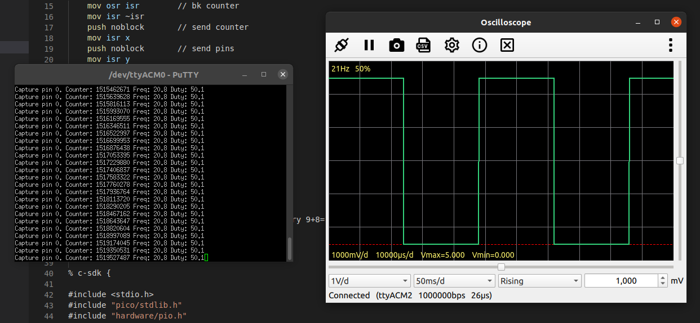
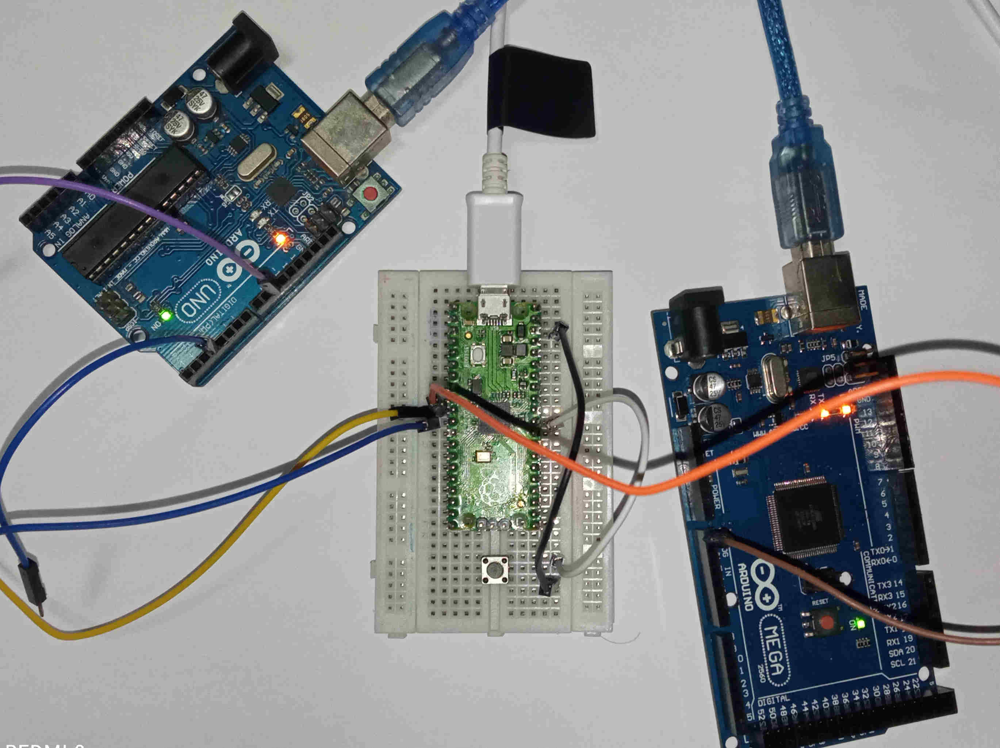

## Pin Capture Timer library for RP2040

A library for capturing signal edges on RP2040 pins using PIO and DMA. It is compatible with both the [Pico SDK](https://raspberrypi.github.io/pico-sdk-doxygen/) and [Arduino](https://github.com/earlephilhower/arduino-pico).

## How to use

- **With Pico SDK**
  Add `capture_edge.pio`, `capture_edge.h`, and `capture_edge.c` to your project.  
  Update `CMakeLists.txt` to include `pico_generate_pio_header` and the required libraries: `pico_stdlib`, `hardware_irq`, `hardware_pio`, `hardware_clocks`, and `hardware_dma`.  
  See [`CMakeLists.txt`](sdk/CMakeLists.txt).

- **With Arduino**
  Add `capture_edge.pio.h`, `capture_edge.h`, and `capture_edge.c` to your project.

- Set the number of pins to capture with `CAPTURE_EDGE_PIN_COUNT` in `capture_edge.pio`, or in `capture_edge.pio.h` when using Arduino.

- Captured pins start at `pin_base`. Any consecutive GPIOs starting from that pin can be captured.

- Define capture handlers that receive the counter value and the edge type (`rising` or `falling`).

- Change `CAPTURE_EDGE_IRQ_NUM` if it conflicts with interrupts used by other PIO state machines. Valid values are `0` to `3`.

See [`main.c`](sdk/main.c) for an example that calculates **frequency** and **duty cycle**.

The counter increments every 5 clock cycles. This value is defined in `COUNTER_CYCLES`.

To obtain the total clock divisor, multiply:

`COUNTER_CYCLES * clk_div`

## Functions

### `void capture_edge_init(PIO pio, uint pin_base, uint pin_count, float clk_div, uint irq)`

**Parameters:**

- **pio** — load the capture program into `pio0` or `pio1`
- **pin_base** — first GPIO to capture
- **pin_count** — number of consecutive GPIOs to capture (1 or 2; passing 0 or a value greater than 2 triggers `panic()`)
- **clk_div** — PIO clock divisor
- **irq** — PIO IRQ to use. Valid values for `pio0`: `PIO0_IRQ_0`, `PIO0_IRQ_1`; for `pio1`: `PIO1_IRQ_0`, `PIO1_IRQ_1`. This is useful when other state machines are also using IRQs.

### `void capture_edge_set_handler(uint pin, capture_handler_t handler)`

**Parameters:**

- **pin** — pin to capture
- **handler** — callback function called when an edge is captured

### `void capture_edge_remove(void)`

Clears the handlers and removes the PIO program from memory.

## Handler function

### `void capture_handler(uint counter, edge_type_t edge)`

**Parameters received:**

- **counter** — captured counter value
- **edge** — edge type: `EDGE_RISING = 2`, `EDGE_FALLING = 1`

## Accuracy

With `clk_div = 1`, the frequency measurement resolution is 18 clock cycles (9 cycles per edge).  
At a 125 MHz system clock, this gives:

- edge timing resolution: `0.072 µs`
- frequency measurement resolution: `0.144 µs`

 
  <i>Capturing edges with the RP2040 and verifying the signal with an oscilloscope</i>  

 
  <i>An Arduino Uno generates the signal, a Mega is used as the oscilloscope, and the RP2040 captures the edges</i>  
